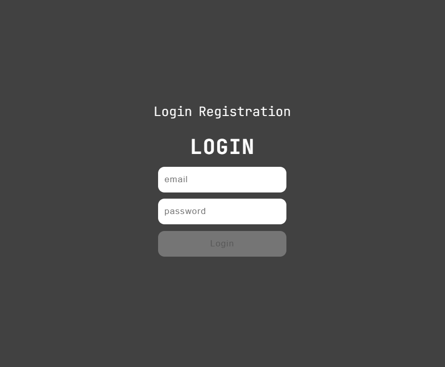
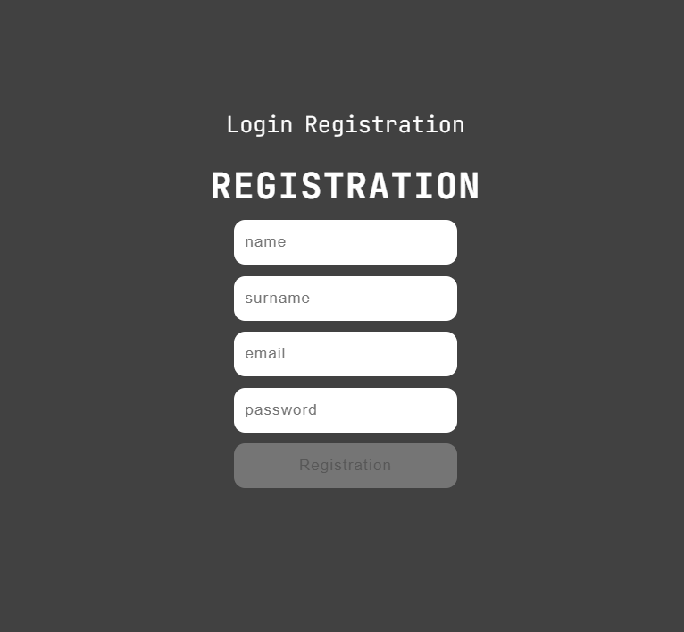
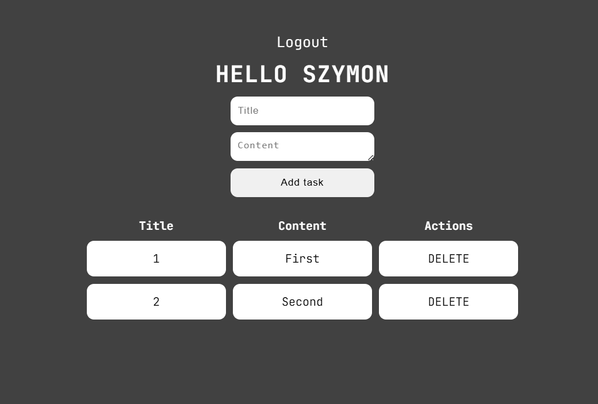

# 📌 To-Do List

Prosta aplikacja **To-Do List** składająca się z backendu w **Python (Flask)** oraz frontendu w **JavaScript (React)**.

## 🔹 Funkcjonalności
✅ Rejestracja i logowanie użytkownika  
✅ Tworzenie, przeglądanie i usuwanie zadań przypisanych do konta  
✅ Prosty i czytelny interfejs dzięki **styled-components**  

## 🖼 Zrzuty ekranu





## 🛠 Technologie
- **Backend:** Python + Flask  
- **Frontend:** React + styled-components  
- **Baza danych:** SQLite  

## 🚀 Uruchomienie

### Backend
1. Przejdź do katalogu backendu:
   ```sh
   cd backend
   ```
2. Uruchom serwer:
   ```sh
   python run.py
   ```

### Frontend
1. Przejdź do katalogu frontendu:
   ```sh
   cd frontend
   ```
2. Uruchom aplikację:
   ```sh
   npm run dev
   ```
